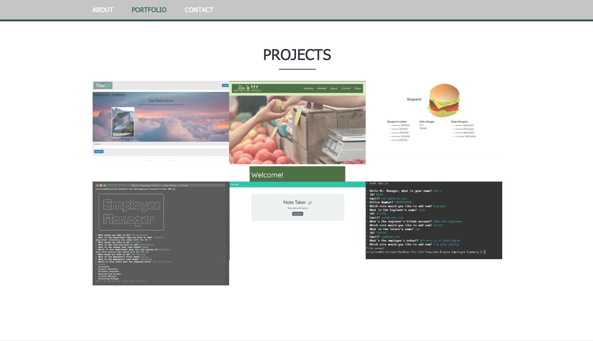

# React-Portfolio

## Deployed URL: https://cris-portfolio.herokuapp.com

## Table of Contents 

* [Demonstration](#demonstration)

* [Description](#description)

* [Installation](#installation)

* [Usage](#usage)

* [License](#license)

* [Technologies](#technologies)

## Demonstration

## Description

This Website is a showcase of my skillset, projects and accomplishments so far, doing my best at having a clean and polished UI

## Installation

To install necessary dependencies, run the following command:

                        
                        'npm i' 
                    

 ## Technologies    

 - React
 - Heroku
 - Node
 - Express
 - React Bootstrap
 - 

## Usage

[browse through the website to see the projects that were made, about me, and contact information](https://cris-react-portfolio.herokuapp.com/) 

## License

This project is licensed under the MIT license.
  

                    